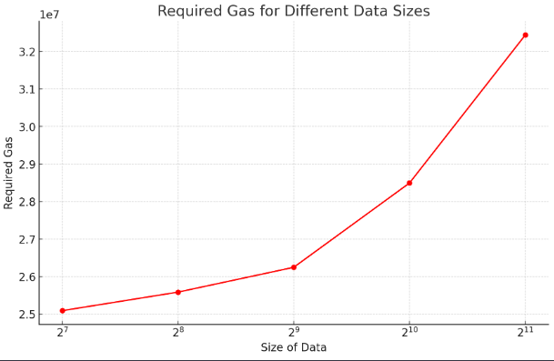
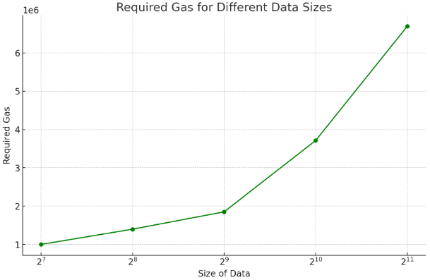

# Arbitrum Contracts Documentation

This documentation provides an overview of the contracts used for decryption on the Arbitrum platform. To accommodate the contract size limit on Arbitrum, the decryption functionality is distributed across six distinct contracts, each responsible for a specific aspect of the decryption process.

## Overview of Contracts
### registry-contract 
- **Purpose**: Stores a list of custom contracts and facilitates the communications with the FairyRing through passing the key requests and submiting the keys to the corresponding contracts.
### Key Functions in `registry-contract`
- **Functionality**: 
  #### add_contract
  - **Function**: Adds a contract along with its owner and corresponding encryption condition to the list
  #### get_contract
  - **Function**: Returns the owner and condition of a contract based on its address
  #### get_all_contracts
  - **Function**: Returns a list of all registered contracts
  #### check_condition_proxy
  - **Function**: This function gets a contract address and calls its `check_condition` function to to check if the condition is met or not.
  - Returns: `string memory`: If the condition was met, it will be returned but if it is not met, an empty string will be returned.
  #### send_key
  - **Function**: This function gets a condition and its corresponding decryption key, then loops over the list of the registered contracts to find the contract with that condition and submits the key to that contract.

### decrypter-contract
- **Purpose**: Acts as the central contract coordinating the decryption process and interfacing with other necessary contracts.
- **Functionality**: 
  - Main Function: `decrypt`
  - Parameters: 
    - `uint8[] memory c`: The ciphertext to be decrypted.
    - `uint8[] memory skbytes`: The aggregated decryption key in bytes format.
    - `address ibe_contract`: Address of the IBE (Identity-Based Encryption) contract.
    - `address decrypter_contract`: Address of the decrypter helper contract.
    - `address mac_contract`: Address of the MAC (Message Authentication Code) contract.
  - Returns: `uint8[] memory`: The decrypted data.
  - Additional Notes: The function accepts the addresses of three helper contracts as parameters. These addresses could alternatively be hardcoded.

### ibe-contract
- **Purpose**: Executes IBE decryption to retrieve the file key from the ciphertext.
- **Dependencies**:
  - `ibe-contract-pairing`: Performs the pairing operation.
  - `ibe-contract-hashing`: Conducts the hashing process.
- **Note**: Pairing and hashing are implemented in separate contracts to manage contract size limitations. The address of the two helper contracts are hardcoded in `ibe-contract`.

### chacha20-contract-decrypter
- **Function**: Executes Chacha20Poly1305 decryption using the file key obtained through IBE decryption.

### chacha20-contract-mac
- **Function**: Computes the header MAC (Message Authentication Code) of the ciphertext for verification in the `decrypter-contract`.

## Testing

This section outlines the process for testing the functionality of the Arbitrum Contracts, specifically focusing on an auction contract scenario.

### Overview

In order to test the functionality, a basic implementation of an auction contract has been included in `custom-contract`. 

### Key Functions in `custom-contract`

#### setVars
- **Function**: Initializes the contract by setting various parameters and addresses.
- **Parameters**:
  - `address registry, address decrypter, address ibe_contract, address decrypter_contract, address mac_contract`: Addresses of the helper contracts and necessary components.
  - `uint128 deadline, uint128 id, uint128 fee`: Auction-specific parameters.
- **Usage**: Called at the beginning to set up the auction environment.

#### submitEncBid
- **Function**: Allows submission of an encrypted bid.
- **Parameters**:
  - `uint8[] memory tx`: The encrypted bid data.
  - `string calldata condition`: The condition for bid submission.
- **Returns**: `uint8[] memory`: The status of the bid submission.
- **Usage**: Participants use this to submit their bids in encrypted form. The condition is assumed to be the concatenation of the id and the deadline of the auction in this example contract.

#### submitKey
- **Function**: Submits the aggregated key for decrypting the bids.
- **Parameters**: 
  - `uint8[] memory k`: The aggregated decryption key.
- **Returns**: `bool`
- **Usage**: Used to submit the key for decryption.

#### dec
- **Function**: Decrypts a transaction.
- **Parameters**:
  - `Vec<u8> tx`: The transaction to decrypt.
  - `Vec<u8> key`: The decryption key.
  - `Address ibe_c`: The address of the IBE (Identity-Based Encryption) contract.
  - `Address dec_c`: The address of the decryption contract.
  - `Address mac_c`: The address of the MAC (Message Authentication Code) contract.
- **Returns**: `Result<Vec<u8>, Vec<u8>>`: Returns the decrypted transaction as a `Vec<u8>` on success, or an error on failure.
- **Usage**: This function is used for decrypting a transaction using the provided key, and the relevant addresses for IBE, decryption, and MAC contracts. It checks if the contract is initialized before proceeding with the decryption process.

#### check_winner
- **Function**: Returns the winner of the bid.
- **Parameters**: None.
- **Returns**: `Result<String, Vec<u8>>`: Returns the winner bid as a `String` on success, or an error on failure.

#### check_finished
- **Function**: Checks if the bidding process is finished.
- **Parameters**: None.
- **Returns**: `Result<bool, Vec<u8>>`: Returns `true` if the bidding process is finished, or an error as a `Vec<u8>` on failure.

### Testing Procedure

1. **Script for Simplification**: 
   - Location: `test-script` folder.
   - Function: Automates the deployment of contracts, encryption of bids, and execution of test case. I also runs the FairyRing and the client. This script gets the private key of a wallet as input. The wallet needs to have some stylus testnet tokens to be able to perform the contract developments and calls. To get the token, the testnet faucet at [Arbitrum Stylus Testnet Faucet](https://bwarelabs.com/faucets/arbitrum-stylus-testnet) can be used.

2. **Pre-requisites**:
   - Repositories: `encrypter`, `FairyRing (arbitrum branch)`, `fairybridge`,  and `ShareGenerator`.
   - Requirement: These repositories need to be built and located alongside the `ArbitrumContracts` directory for the test to function properly.

3. **Execution**:
   - The script initializes the `custom-contract`and submits two encrypted bids. These steps are included in the example code of the `test-script/custom-test`. The script then runs the chain and the client which connects to the custom-tcontract and sends key request to the chain when the condition is met. The keys need to be manually submitted to the chain but after the aggregation, the client fetches the key from the chain and submits it to the contract. After the key submission, the `dec` function can be called for decrypting the bids. Due to the high gas usage, this function can be called through `call()` instead of `send()`. 
   - Note: In the current test setup, two bids are submitted. The bid values can be modified through changing the values on lines `97` and `99` of the `setup.sh` script. Moreover, the condition for the encryption and decryption is hardcoded as `1456` assuming the `id = 1` and `deadline = 456`. In order to modify this, the value should be changed on lines `91, 97, and 99` of the script. Also, on lines `107-108, 114, and 120` of the example. (`test-script/custom-test/examples/counter.rs`) 

### Benchmarking
The gas requirements for decrypting different data sizes on are represented below:

on-chain decryption:

off-chain decryption and on-chain submission of plain data:

